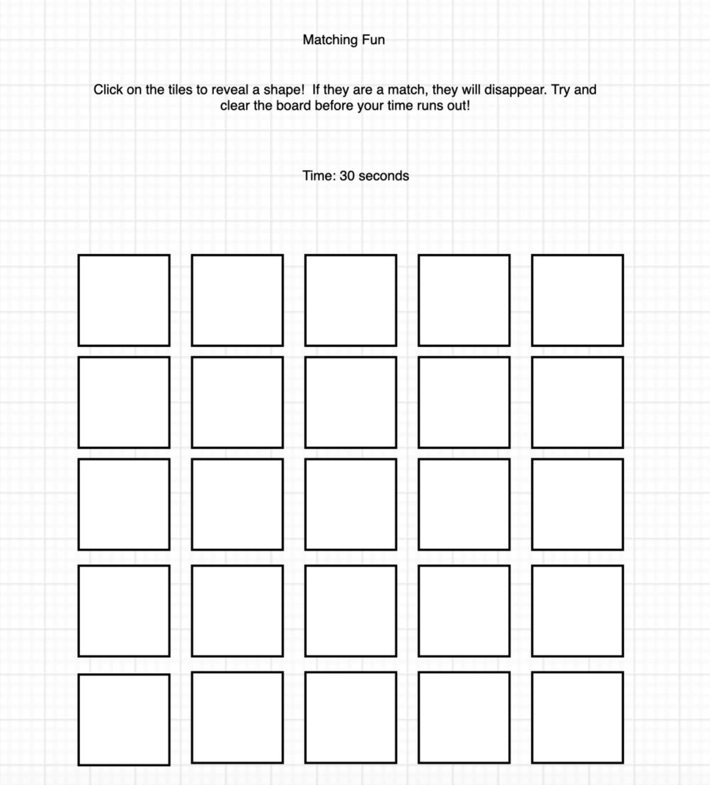
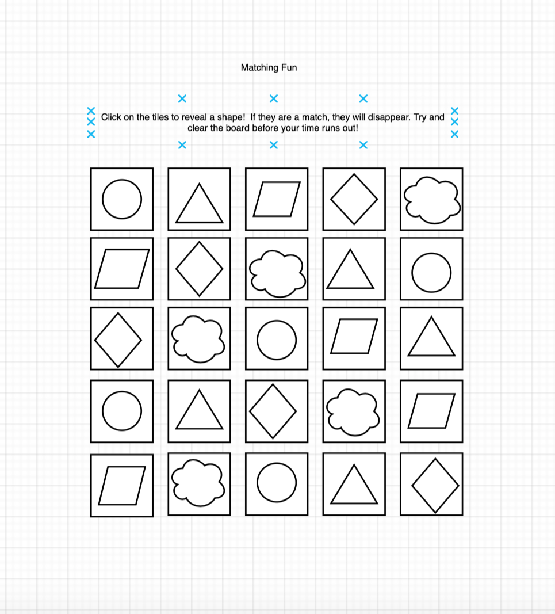
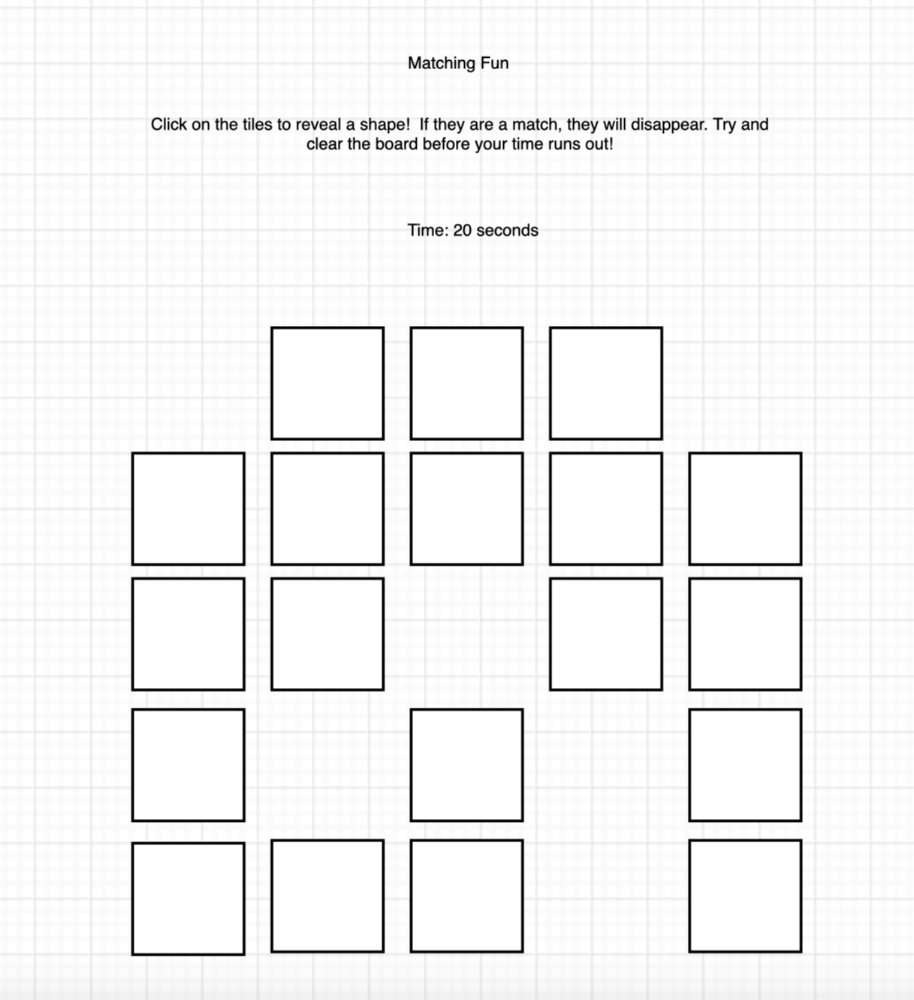

# projectone

## Matching Fun! 

### Click on the tiles to reveal a shape. If they are a match, they will disappear. You have 30 seconds to clear the board! Player one goes first

#### Time: 30 seconds.

##### The premise of this game is to help you with your memory!

###### Steps

1. This game will have squares that are blank. It will be a 4x4 grid. When you click on each box, they will flip over and reveal either a shape or an image. 

2. As well, when you click on a square the timer will begin counting down from 30 seconds. 

3. Each square will show for one second before flipping back to a blank screen. 

4. When a player clicks on two squares that have the same image or shape, the two squares will disappear. 

5. When you reach five seconds, the timer will have an alert after. 

6. Every match will add a certain amount of points to the users score. The total will be read at the end of the game and stored nd displayed for player one on the board. 

7. The game will reload for player 2 and the second game will be played. The score will be calculated again and displayed. 

8. Whoever has the higher score will be announced the winner!

Technologies - HTML, CSSM, DOM Manipulation, JavaScript

Long term stretch goal - leveling up and adding the grid as time goes on